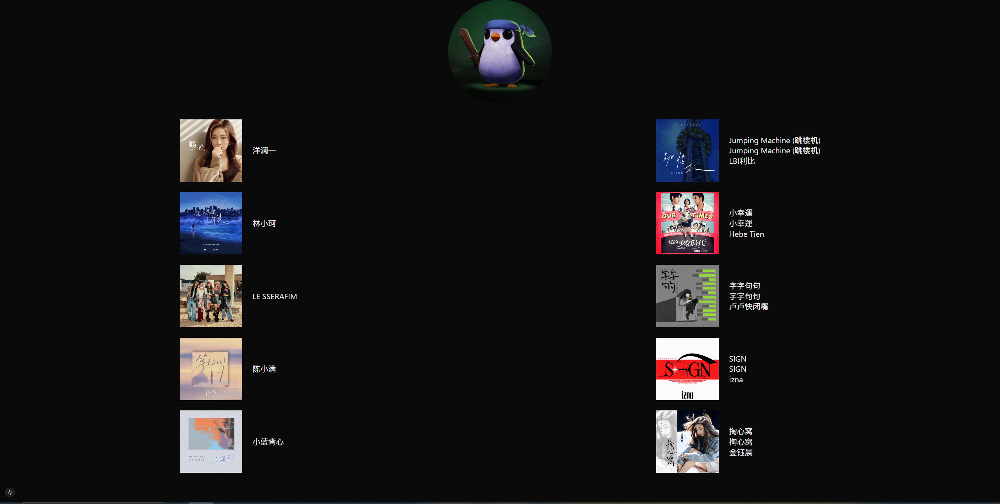

## Introduction
This project was made by Nakra Ath-Ly, Nick Wu, Chantakrak Ath-Ly, and Sarey Chek. This application focuses on using the Spotify API and the User's info to analyze their most listened to tracks and artists.

## Project Detail
In this project, we utilized Next.js, TailwindCSS, and Typescript to create the web application.  We created a boilerplate webpage and then slowly replaced the components with the actual data extracted from the Spotify API using GET requests through Axios.  The Spotify API has a variety of different scopes, but we narrowed it down to only use the ones that extract the user's profile infromation and their listening history.

## Project Process
We utilized JIRA to organize our project and evaluate our progress.  Using the SCRUM methodology, we assigned one person a task and required a minimum of two other people to review for any changes necessary through a pull request.  We would add every minute task as a JIRA task to proceed systematically and to ensure unanimous understanding before moving on to the next step.

## Project Screenshots

## Challenges
The most challenging part of the project was creating the initial connection between the web application and the API and navigating GET requests within the API.

## What did I learn
From this project, we learned a little more about the Software Development Life Cycle as we tried to mimic how a project would be done in a professional setting.  We also learned more about APIs and how to incorporate them into web applications.  With this project, we hope to expand on it by incorporating an extended listening history and analyzing listening habits throughout a year.  We also look forward to implementing a song recommendation feature based off the user's listening trends. 